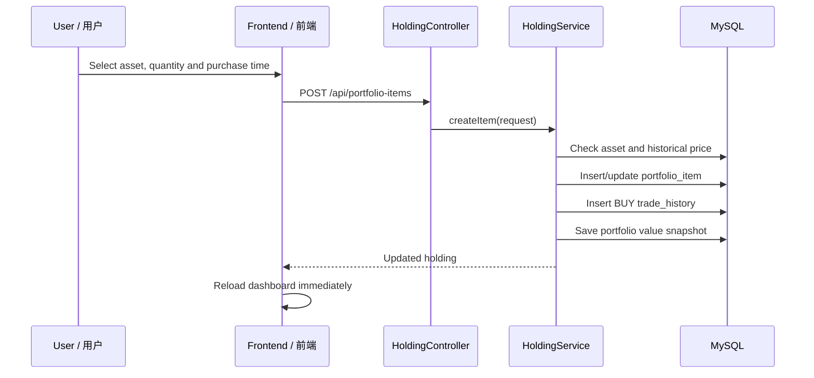
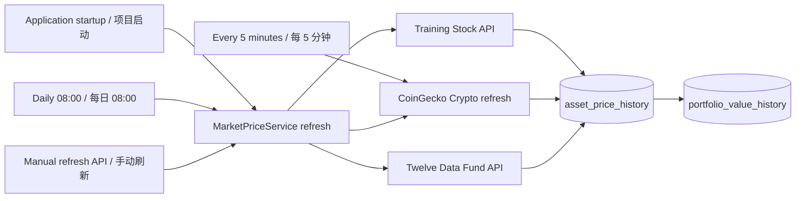
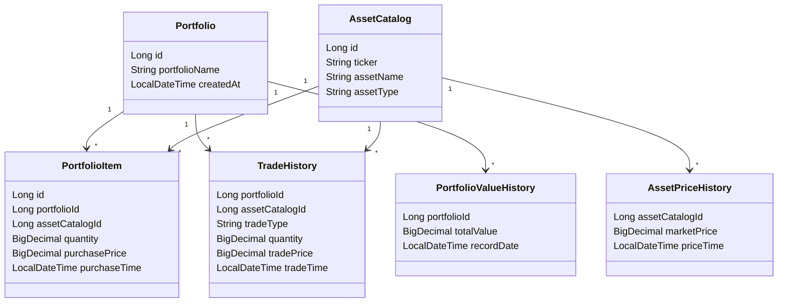
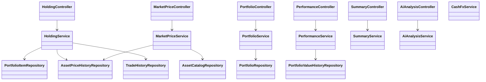

# Portfolio Manager / 投资组合管理系统

> A Spring Boot + MySQL training project for managing multiple investment portfolios, synchronising market prices, recording trades, and visualising portfolio performance.  
> 一个基于 Spring Boot + MySQL 的培训项目：管理多个投资组合、同步真实行情、记录交易，并展示组合表现。

## 1. Project Requirements / 项目需求

The system allows a user to create multiple portfolios and switch between them. Each portfolio owns its own holdings, cost basis, profit/loss, trade history, and performance history.  
系统允许用户新建并切换多个投资组合；每个组合独立拥有持仓、成本、盈亏、交易流水和绩效历史。

Main functions / 核心功能：

- Portfolio management: create and switch portfolios. / 新建、切换投资组合。
- Asset market: Stocks, Funds, Crypto and Cash. / 股票、基金、虚拟币和现金。
- Trading: buy, sell, deposit cash and withdraw cash. / 买入、卖出、存入现金、取出现金。
- Market data: synchronise prices from external APIs and store local history. / 从外部 API 同步行情并保存本地历史。
- Dashboard: total value, return, allocation cards, daily performance chart and holdings table. / 总市值、收益、资产配置、按日绩效曲线和持仓表。
- AI analysis: stream a structured portfolio analysis from DeepSeek. / 通过 DeepSeek 流式生成结构化组合分析。
- Appearance: light/dark mode stored in browser local storage. / 浅色/深色模式，选择保存在浏览器本地。

## 2. Technology Stack / 技术栈

| Layer / 层级 | Technology / 技术 |
|---|---|
| Backend / 后端 | Java 17, Spring Boot 4, Spring MVC |
| Data access / 数据访问 | Spring JDBC (`JdbcTemplate`) |
| Database / 数据库 | MySQL |
| Frontend / 前端 | HTML, CSS, Vanilla JavaScript |
| JSON / JSON 解析 | Jackson |
| Build / 构建 | Maven |
| External data / 外部数据 | Training Stock API, CoinGecko, Twelve Data, FX Rate API, DeepSeek |

The backend follows a simple layered structure: `Controller → Service → Repository → MySQL`.  
后端采用清晰的分层结构：`Controller → Service → Repository → MySQL`。

## 3. Business Flow / 业务流程

### 3.1 Buy Asset / 买入资产



The server uses the selected `priceTime` to look up the recorded market price in the database; the browser never decides the trade price.  
后端根据用户选择的 `priceTime` 从数据库查询已保存的行情价格；浏览器不会自行决定成交价。

### 3.2 Market Refresh / 行情刷新



- Stocks use the training cached-price API and its supported tickers. / 股票使用培训提供的缓存行情 API 及其支持的代码。
- Crypto is fetched in one CoinGecko batch request. / 虚拟币通过 CoinGecko 批量查询。
- Funds use Twelve Data daily NAV data. / 基金使用 Twelve Data 的每日净值数据。
- Repeated price records with the same asset and time are updated, not duplicated. / 相同资产、相同行情时间重复同步时更新而不重复插入。

## 4. Calculation Logic / 计算逻辑

| Item / 指标 | Formula / 公式 |
|---|---|
| Current Price / 当前价 | Latest record in `asset_price_history`; falls back to purchase price if unavailable. / `asset_price_history` 最新价格；无行情时使用买入价。 |
| Market Value / 当前市值 | `quantity × currentPrice` |
| Cost Basis / 成本 | `quantity × purchasePrice` |
| P/L / 盈亏 | `marketValue − costBasis` |
| Total Return / 总收益 | `totalMarketValue − totalCostBasis` |
| Allocation / 资产配置 | Sum market value by `assetType`. / 按资产类型汇总市值。 |

Cash is stored in USD value after FX conversion. It does not display a P/L value in the holdings table.  
现金会按汇率换算后以 USD 市值保存；持仓表中 Cash 不显示 P/L。

## 5. Data Model / 数据库结构

The runtime multi-portfolio model contains the following logical tables.  
当前多组合运行版本使用以下逻辑表：

| Table / 表 | Purpose / 用途 |
|---|---|
| `portfolio` | Portfolio name and creation time. / 组合名称和创建时间。 |
| `asset_catalog` | Tradable asset master data: ticker, name, type. / 可交易资产目录：代码、名称、类型。 |
| `portfolio_item` | Current holding per portfolio and asset. / 某组合当前持仓。 |
| `asset_price_history` | Historical prices from external APIs. / 外部 API 同步的历史行情。 |
| `trade_history` | BUY, SELL, cash deposit and withdrawal records. / 买入、卖出、现金存取流水。 |
| `portfolio_value_history` | Total portfolio value snapshots for the chart. / 折线图使用的组合总市值快照。 |



## 6. Backend Class Diagram / 后端类图



## 7. REST API Overview / REST 接口概览

| Method | Endpoint | Description / 说明 |
|---|---|---|
| `GET` | `/api/portfolios` | List portfolios / 查询组合列表 |
| `POST` | `/api/portfolios` | Create a portfolio / 新建组合 |
| `GET` | `/api/portfolio-items?portfolioId={id}` | List holdings / 查询组合持仓 |
| `POST` | `/api/portfolio-items` | Buy stock, fund or crypto / 买入资产 |
| `POST` | `/api/portfolio-items/cash` | Deposit cash / 存入现金 |
| `POST` | `/api/portfolio-items/{id}/sell?portfolioId={id}` | Sell or withdraw / 卖出或取出现金 |
| `GET` | `/api/portfolio-items/summary?portfolioId={id}` | Portfolio summary / 组合摘要 |
| `GET` | `/api/portfolio-items/performance?portfolioId={id}` | Performance history / 绩效历史 |
| `GET` | `/api/portfolio-items/market/assets` | Latest available assets / 可购买资产与最新价格 |
| `GET` | `/api/portfolio-items/market/assets/{id}/prices` | Asset price history / 单资产价格历史 |
| `POST` | `/api/portfolio-items/market/refresh` | Refresh market prices / 手动刷新行情 |
| `GET` | `/api/ai-analysis/stream?portfolioId={id}` | DeepSeek SSE analysis / DeepSeek 流式分析 |

## 8. Frontend Features / 前端功能

- Type filters for available assets: All, Stocks, Funds, Crypto. / 可交易资产按类型筛选。
- A `Buy` button in each market row opens the correct purchase dialog with the asset preselected. / 行情表每行 Buy 按钮直接打开并预选对应资产。
- Search suggestions for ticker or asset name. / 支持按代码或名称搜索并选择资产。
- Separate purchase dialogs for Stocks, Funds and Crypto. / 股票、基金、虚拟币使用独立买入弹窗。
- Daily performance labels: multiple snapshots on the same day are consolidated to the final value of that day. / 折线图按日展示，同日多条快照只保留最后值。
- Dark mode is controlled in Settings and saved in `localStorage`. / Settings 中切换深色模式，选择保存到 `localStorage`。

## 9. Run Locally / 本地运行

### Prerequisites / 前置环境

- JDK 17
- MySQL 8+
- Maven 3.9+ (or Maven Wrapper)
- A MySQL database named `portfolioDb`

### Configuration / 配置

Edit `src/main/resources/application.properties` for local MySQL credentials. Do **not** commit API keys.  
在 `src/main/resources/application.properties` 配置本机 MySQL；不要提交真实 API Key。

Required optional environment variables / 可选外部服务环境变量：

```powershell
[Environment]::SetEnvironmentVariable("COINGECKO_API_KEY", "your-key", "User")
[Environment]::SetEnvironmentVariable("TWELVE_DATA_API_KEY", "your-key", "User")
[Environment]::SetEnvironmentVariable("DEEPSEEK_API_KEY", "your-key", "User")
```

Close and reopen the terminal after setting a persistent Windows environment variable.  
设置 Windows 永久环境变量后，请关闭并重新打开终端。

### Start / 启动

```powershell
./mvnw.cmd spring-boot:run
```

Or use a local Maven installation / 或使用本地 Maven：

```powershell
mvn spring-boot:run
```

Open: [http://localhost:9001](http://localhost:9001)

## 10. Team Responsibilities / 团队分工

The following division is based on the current project modules. It keeps ownership clear while allowing everyone to review and test the integrated application.  
以下分工基于当前项目模块整理，明确每个人的主要负责范围；整合后的项目仍由全组共同检查和测试。

| Member / 成员 | Main responsibility / 主要职责 | Related modules / 关联模块 |
|---|---|---|
| **Feng** | Build the project foundation, design the database and integrate market-data APIs. Implement available-asset listing, search and automatic price refresh. / 搭建项目框架、设计数据库、接入行情 API；负责可交易资产列举、搜索和自动刷新价格。 | `database-setup.sql`, `AssetCatalogRepository`, `AssetPriceHistoryRepository`, `MarketPriceService`, market API clients, `MarketPriceController` |
| **Mina** | Implement portfolio creation and portfolio-specific holding management: create/buy, update/merge, sell and delete holdings. / 实现投资组合创建及组合内持仓的创建（买入）、修改/合并、卖出和删除。 | `PortfolioController`, `PortfolioService`, `HoldingController`, `HoldingService`, `PortfolioItemRepository`, `TradeHistoryRepository` |
| **Kamila** | Implement portfolio summary and performance calculation/history. / 实现组合摘要和绩效计算、绩效历史记录与展示。 | `SummaryController`, `SummaryService`, `SummaryRepository`, `PerformanceController`, `PerformanceService`, `PerformanceRepository`, `PortfolioValueHistoryRepository` |
| **Clyde** | Implement cash deposit/withdrawal, foreign-exchange conversion and AI analysis. / 实现现金存取、汇率换算和 AI 分析。 | `CashFxService`, `FxRateApiClient`, cash request DTO,  `AiAnalysisController`, `AiAnalysisService`, DeepSeek streaming output |


Training project only. Market data and AI output are for demonstration and learning, not investment advice.  
仅用于培训、演示和学习；市场数据和 AI 分析均不构成投资建议。
